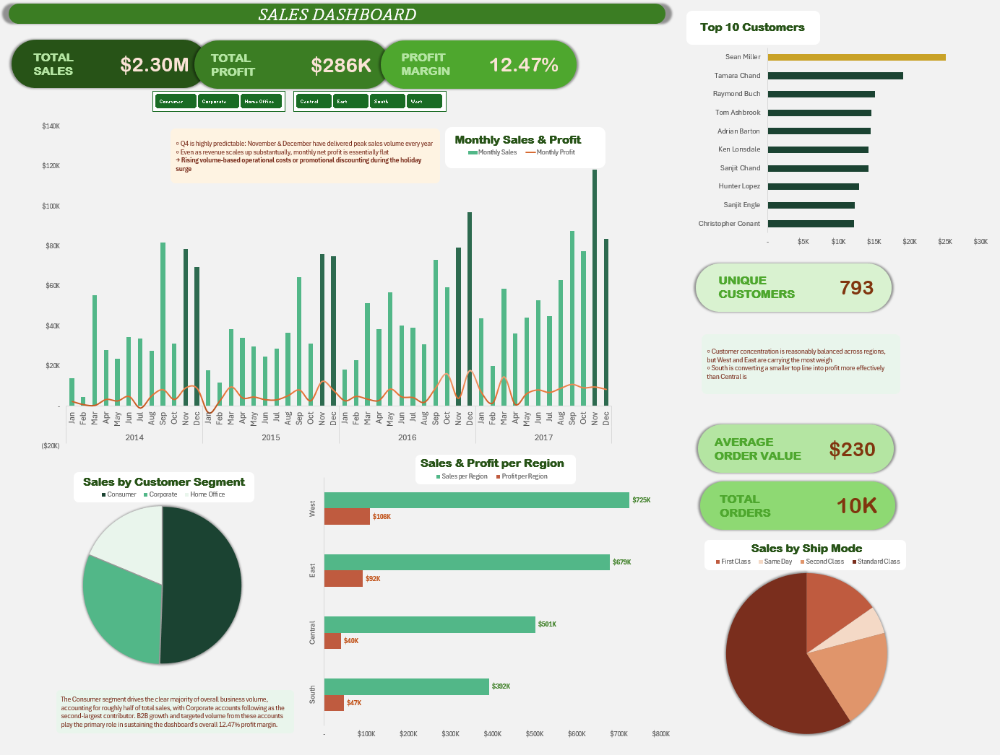

# 01_excel_sales_dashboard

A sales dashboard built in Excel, covering $2.30M in total sales across roughly 10K orders and 793 unique customers, with a 12.47% profit margin. The dashboard uses pivot tables and charts to break performance down by month, region, customer segment, and ship mode.

## Visualization

## What it shows

- Monthly sales and profit trends from 2014 through 2017
- Sales and profit split by region (West, East, Central, South)
- Sales by customer segment (Consumer, Corporate, Home Office)
- Top 10 customers by revenue
- Order value and shipping mode breakdown

## What I found

Q4 is consistently the strongest period - November and December show a repeating spike in sales volume every year. Interestingly, monthly profit stays roughly flat even as sales volume climbs, which points to rising costs or promotional discounting eating into margin during that seasonal surge. Consumer accounts for roughly half of total business volume, with Corporate a clear second - that pairing is what's really driving the 12.47% overall margin. Customer concentration is fairly balanced across regions, though West and East carry slightly more weight; South, meanwhile, converts a smaller top line into profit more effectively than Central does.

## Skills demonstrated

- Building KPI cards and pivot-table-driven charts to summarize a large dataset
- Structuring a dashboard so different questions (time, region, segment, customer) each get their own view rather than one crowded chart
- Reading a dashboard for a story, not just numbers — spotting that flat profit alongside rising sales volume signals a margin issue worth flagging, not just reporting

## Tools used

- Excel (pivot tables, pivot charts, KPI cards)
