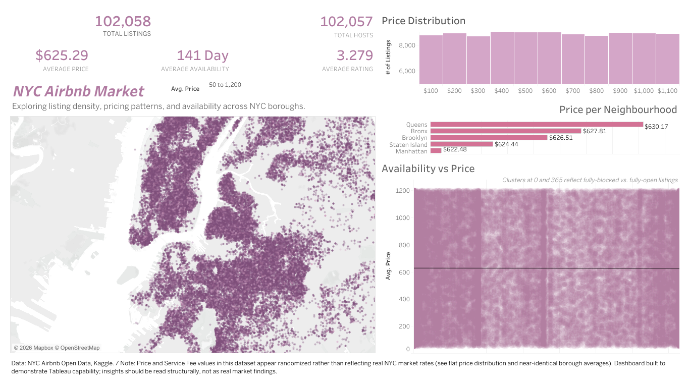

# 03_tableau_nyc_airbnb

A Tableau dashboard exploring NYC Airbnb listings — density, pricing, and availability across boroughs, built on ~102,000 listings and hosts from the [NYC Airbnb Open Data](https://www.kaggle.com/datasets/dgomonov/new-york-city-airbnb-open-data) set (Kaggle).

## Visualization

🔗 [Live on Tableau Public](https://public.tableau.com/app/profile/kalina.stefanova/viz/NYC_17846464094140/NYCAIrbnbMarket#1)

## What it shows

- Listing density across NYC boroughs, mapped geographically
- Price distribution across the $50–$1,200 range
- Average price per neighborhood (Queens, Bronx, Brooklyn, Staten Island, Manhattan)
- Availability vs. price, split into clusters at 0 and 365 days to separate fully-booked from fully-open listings

## A note on the data

The price and service fee values in this dataset are randomized rather than reflecting actual NYC market rates (visible in the flat price distribution and the near-identical averages across boroughs).  The insights should be read as structural, not as real market findings.

## Skills demonstrated

- Combining a geographic map with distribution and comparison charts in one dashboard layout
- Using clustering to separate distinct behavior patterns (fully-blocked vs. fully-open listings) within a scatter view
- Being upfront about a dataset's limitations rather than presenting synthetic patterns as real ones

## Tools used

- Tableau
- [NYC Airbnb Open Data](https://www.kaggle.com/datasets/dgomonov/new-york-city-airbnb-open-data) (Kaggle)

Same caveat as before — worth double-checking this is the exact upload you used, since a few near-identical NYC Airbnb datasets exist on Kaggle.
